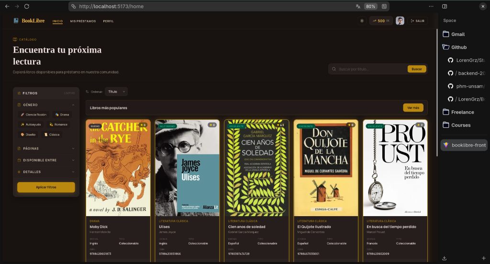
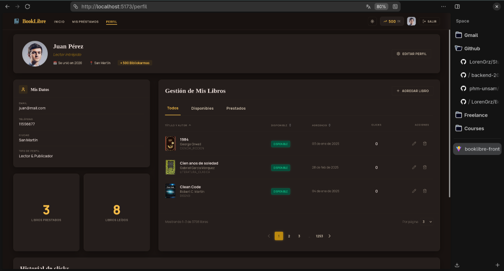
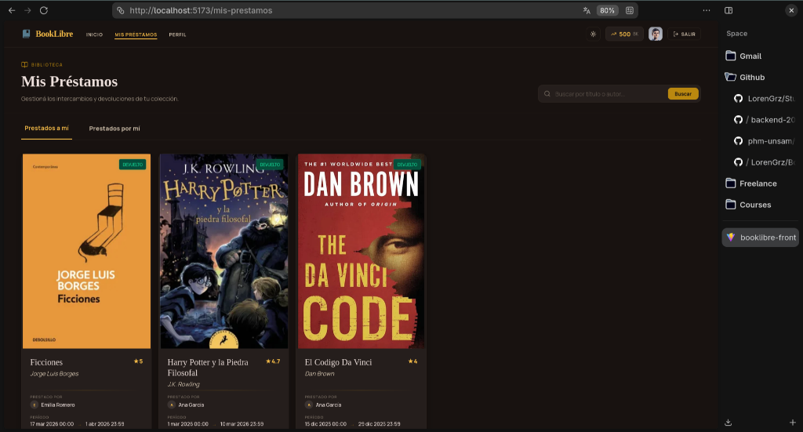
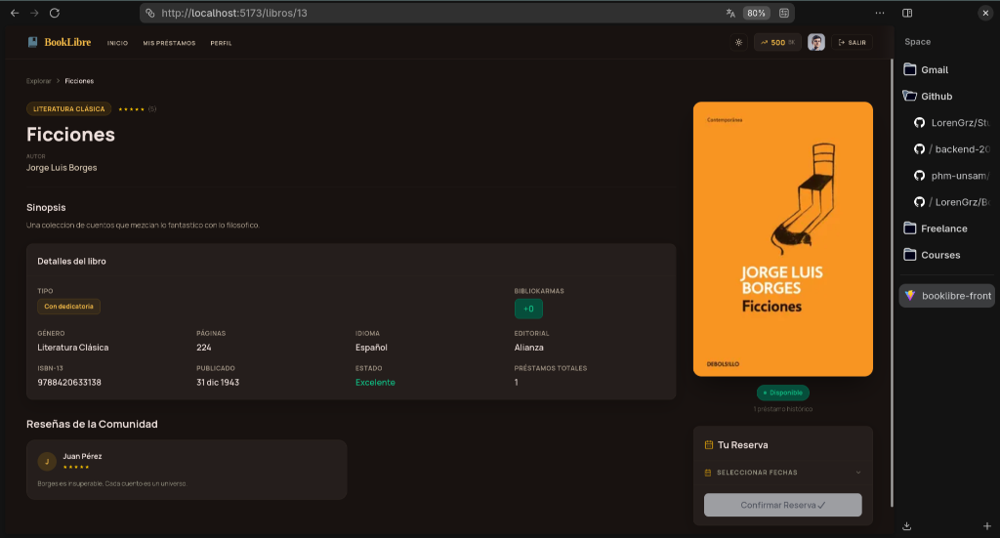

# BookLibre 📚

**BookLibre** es una plataforma colaborativa para que una comunidad de lectores pueda compartir, prestar y reservar libros de manera sencilla y eficiente.

---

## 📸 Capturas de Pantalla

### 🔍 Catálogo y Búsqueda de Libros (`/home`)
Explora los libros disponibles en la comunidad, filtra por género u ordena por títulos populares.


### 👤 Perfil de Usuario (`/perfil`)
Administra tu información personal, gestiona los libros que tienes disponibles para prestar y realiza un seguimiento de tus lecturas.


### 🤝 Mis Préstamos (`/mis-prestamos`)
Visualiza y gestiona las solicitudes de préstamos, tanto los libros que te han prestado como los que has prestado a otros miembros de la comunidad.


### 📖 Detalle y Reserva de Libros (`/libros/:id`)
Consulta la sinopsis, detalles de edición, opiniones de la comunidad y reserva tu próxima lectura.


---

## 🛠️ Tecnologías Utilizadas

El proyecto está construido bajo una arquitectura moderna y base de datos políglota para optimizar el rendimiento y la persistencia de datos.

### Backend
* **Lenguaje:** [Kotlin](https://kotlinlang.org/)
* **Runtime:** Java 21
* **Framework:** [Spring Boot 3.3.1](https://spring.io/projects/spring-boot)
  * **Spring Web** & **Spring Security** (Autenticación JWT)
  * **Spring Data JPA** & **Spring Data MongoDB** & **Spring Data Redis**
  * **Netflix GraphQL DGS** (Servidor GraphQL)
  * **Springdoc OpenAPI** (Documentación Interactiva Swagger UI)
* **Migración de Base de Datos:** [Flyway](https://flywaydb.org/)
* **Testing:** Kotest, JUnit 5, Mockk, Mockito-kotlin, Jacoco (reportes de cobertura)

### Frontend
* **Framework / Librería:** [React 19](https://react.dev/)
* **Lenguaje:** [TypeScript](https://www.typescriptlang.org/)
* **Herramienta de Construcción:** [Vite 7](https://vite.dev/)
* **Estilado:** [Tailwind CSS v4](https://tailwindcss.com/)
* **Enrutado:** [React Router DOM](https://reactrouter.com/)
* **Cliente HTTP:** [Axios](https://axios-http.com/)
* **Iconografía & Componentes:** Lucide React, React Day Picker, React Toastify
* **Testing:** Vitest, React Testing Library, jsdom

### Almacenamiento y Caching (Base de datos políglota)
* **PostgreSQL:** Almacena usuarios, préstamos, reservas e historial de puntuaciones (persistencia relacional tradicional).
* **MongoDB:** Almacena el catálogo de libros, detalles de publicación y sinopsis (documentos flexibles).
* **Redis:** Caching de datos de alto acceso, como el top 10 de libros con más clics.

---

## 🚀 Cómo Correr el Proyecto Localmente

### Prerrequisitos
Para ejecutar el proyecto de forma local, asegúrate de tener instalado:
* **Docker & Docker Compose**
* **Java Development Kit (JDK) 21**
* **Node.js** (versión recomendada >= 20) y el gestor de paquetes **pnpm**

---

### Paso 1: Levantar las Bases de Datos (Docker)
El proyecto utiliza contenedores Docker para levantar PostgreSQL, MongoDB y Redis de manera rápida.

1. Ve a la carpeta del backend:
   ```bash
   cd backend
   ```
2. Levanta únicamente los servicios de base de datos en segundo plano:
   ```bash
   docker compose up -d redis postgres mongo
   ```

*(Opcional) Si quieres ver el estado de los contenedores, puedes ejecutar `docker compose ps`.*

---

### Paso 2: Levantar el Servidor Backend (Kotlin + Spring Boot)
1. Estando en la carpeta `backend`, ejecuta la aplicación usando Gradle:
   ```bash
   ./gradlew bootRun
   ```
2. Una vez levantado, los endpoints y documentación estarán disponibles en:
   * **Servidor API:** [http://localhost:8080](http://localhost:8080)
   * **Documentación REST (Swagger UI):** [http://localhost:8080/swagger-ui.html](http://localhost:8080/swagger-ui.html)
   * **GraphQL Playground (GraphiQL):** [http://localhost:8080/api/graphiql](http://localhost:8080/api/graphiql)

---

### Paso 3: Levantar el Frontend (React + Vite)
1. Dirígete a la carpeta `frontend` desde la raíz del proyecto:
   ```bash
   cd ../frontend
   ```
2. (Opcional) Si deseas cambiar la URL del backend, puedes crear un archivo `.env` a partir de `.env.example`:
   ```bash
   cp .env.example .env
   ```
3. Instala las dependencias necesarias:
   ```bash
   pnpm install
   ```
4. Inicia el servidor de desarrollo:
   ```bash
   pnpm dev
   ```
5. Abre en tu navegador la URL que indica la consola:
   * **Aplicación:** [http://localhost:5173](http://localhost:5173)

---

### Método Alternativo: Levantar Todo con Docker Compose
Si prefieres no configurar Java o Node.js de forma local, puedes levantar la aplicación completa (Bases de datos + Backend + Frontend) usando la configuración de Docker Compose:

1. Ve a la carpeta del backend:
   ```bash
   cd backend
   ```
2. Corre el compose completo:
   ```bash
   docker compose up --build
   ```
El backend estará en `http://localhost:8080` y el frontend en `http://localhost:5173`.
